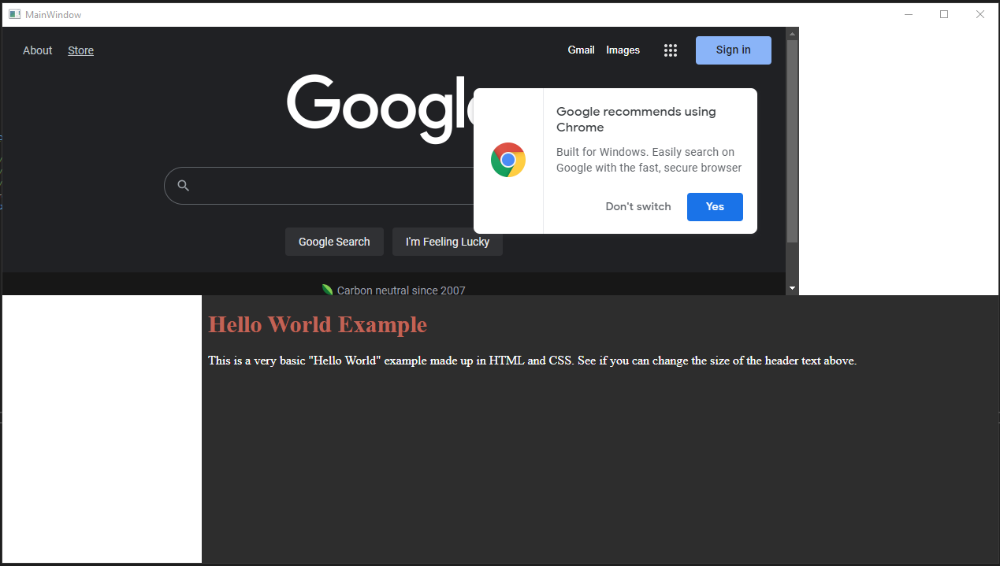

# Webview2 WPF Hello World
Short example of how to use Webview 2 in WPF components. This example loads two offset WebView2 components one targeting https://google.com and the other targets a local file named index.html. 

